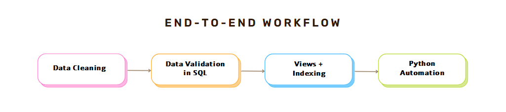

# 𝗔𝘂𝘁𝗼𝗺𝗮𝘁𝗶𝗻𝗴 𝗦𝗤𝗟 𝗪𝗼𝗿𝗸𝗳𝗹𝗼𝘄𝘀 𝘄𝗶𝘁𝗵 𝗥𝗲𝗮𝗹-𝗪𝗼𝗿𝗹𝗱 𝗗𝗮𝘁𝗮

This project is perfect for:  
-Aspiring Data Analysts or Engineers learning how to build full workflows, not just run SQL queries

-Students or professionals seeking hands-on experience with data cleaning, validation, and performance tuning

-Anyone exploring real-world data projects to strengthen their portfolio using SQL + Python automation


## What it does:
-Validates entries (price ranges, duplicates, etc.)  
-Creates three analytical SQL views:  
-  SalesByCuisine  
  -  DishesByPriceRange  
- Regional_StreetFood_Analysis  
-Adds clustered + non-clustered indexes  
-Runs entire workflow with one command
##  Setup Instructions

To run this project locally:

```bash
git clone https://github.com/shajiaalianwar55/sql-street-food-pipeline.git
cd sql-street-food-pipeline

python -m venv .venv
.venv\Scripts\activate       # On Windows
# OR
source .venv/bin/activate    # On Mac/Linux

pip install -r requirements.txt
python scripts/build_pipeline.py
```
## Authors

Shajia Ali Anwar : https://github.com/shajiaalianwar55   
Feel free to open issues or PRs!